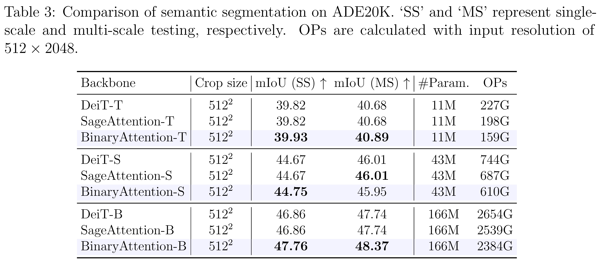

<div align="center">

<h1>BinaryAttention: One-Bit QK-Attention for Vision and Diffusion Transformers</h1>

<div>
    <a href='https://github.com/EdwardChasel' target='_blank'>Chaodong Xiao<sup>1,2</sup></a>,
    <a href='https://scholar.google.com.hk/citations?hl=zh-CN&user=UX26wSMAAAAJ' target='_blank'>Zhengqiang Zhang<sup>1,2</sup></a>,
    <a href='https://www4.comp.polyu.edu.hk/~cslzhang/' target='_blank'>Lei Zhang<sup>1,2,† </sup></a>
</div>
<div>
    <sup>1</sup>The Hong Kong Polytechnic University, <sup>2</sup>OPPO Research Institute
</div>
<div>
	(†) corresponding author
</div>

[[📝 arXiv paper]](https://arxiv.org/abs/2603.09582)

---

</div>

#### 🚩Accepted by CVPR2026

## 🎬 Overview

<p align="center">
  
</p>

## 📖 Abstract

Transformers have achieved widespread and remarkable success, while the computational complexity of their attention modules remains a major bottleneck for vision tasks. Existing methods mainly employ 8-bit or 4-bit quantization to balance efficiency and accuracy. In this paper, with theoretical justification, we indicate that binarization of attention preserves the essential similarity relationships, and propose BinaryAttention, an effective method for fast and accurate 1-bit qk-attention. Specifically, we retain only the sign of queries and keys in computing the attention, and replace the floating dot products with bit-wise operations, significantly reducing the computational cost. We mitigate the inherent information loss under 1-bit quantization by incorporating a learnable bias, and enable end-to-end acceleration. To maintain the accuracy of attention, we adopt quantization-aware training and self-distillation techniques, mitigating quantization errors while ensuring sign-aligned similarity. BinaryAttention is more than 2x faster than FlashAttention2 on A100 GPUs. Extensive experiments on vision transformer and diffusion transformer benchmarks demonstrate that BinaryAttention matches or even exceeds full-precision attention, validating its effectiveness. Our work provides a highly efficient and effective alternative to full-precision attention, pushing the frontier of low-bit vision and diffusion transformers.

## 🎯 Main Results

* ### Image Classification on ImageNet-1K

<p align="center">
  
</p>

* ### Object Detection and Instance Segmentation on COCO

<p align="center">
  
</p>

* ### Semantic Segmentation on ADE20K

<p align="center">
  
</p>

* ### Image Generation on ImageNet-1K

<p align="center">
  
</p>

## 🛠️ Getting Started

```bash
# 1. Clone the repository
git clone https://github.com/EdwardChasel/BinaryAttention.git
cd BinaryAttention

# 2. Create and activate a new conda environment
conda create -n BinaryAttention python=3.10
conda activate BinaryAttention

# 3. Install dependent packages
pip install --upgrade pip
pip install -r requirements.txt
```

## ✨ Pre-trained Models


<summary> ImageNet-1k Image Classification </summary>
<br>

<div>

|      name      |   pretrain   | resolution | acc@1 | #param | OPs|                                                                             download                                                                              |
| :------------: | :----------: | :--------: | :---: | :----: | :---: | :---------------------------------------------------------------------------------------------------------------------------------------------------------------: |
| BinaryAttention-T  | ImageNet-1K  |  224x224   | 72.88  |  6M   |  1.1G   |       [ckpt](https://drive.google.com/file/d/1Ii08AKRvhyTxN1EQKj4KGVC5y_zzCwIe/view?usp=sharing) |
| BinaryAttention-S  | ImageNet-1K  |  224x224   | 80.24  |  22M   |  4.3G   |       [ckpt](https://drive.google.com/file/d/1vjBI85DrnWNTbzS-UpUtEptoyq0uEVid/view?usp=sharing) |
| BinaryAttention-B  | ImageNet-1K  |  224x224   | 82.04  |  87M   |  17.0G  |       [ckpt](https://drive.google.com/file/d/1Sk52vY8SdNQR5QKuj6KKvc_FYGDYTrMj/view?usp=sharing)  |
| BinaryAttention-B  | ImageNet-1K  |  384x384   | 83.64  | 87M   |  50.2G  |       [ckpt](https://drive.google.com/file/d/1c8usSZQEPTFPzxIjKoxVi_ql1rxfXA6V/view?usp=sharing)  |

</div>


## 📚 Data Preparation

ImageNet is an image database organized according to the WordNet hierarchy. Download and extract ImageNet train and val images from http://image-net.org/. Organize the data into the following directory structure:

```
imagenet/
├── train/
│   ├── n01440764/  (Example synset ID)
│   │   ├── image1.JPEG
│   │   ├── image2.JPEG
│   │   └── ...
│   ├── n01443537/  (Another synset ID)
│   │   └── ...
│   └── ...
└── val/
    ├── n01440764/  (Example synset ID)
    │   ├── image1.JPEG
    │   └── ...
    └── ...
```

## 🚀 Quick Start

To train BinaryAttention models for classification on ImageNet, use the following commands for different configurations:

```bash
python -m torch.distributed.launch --nproc_per_node=8 --use_env main.py \
       --model </name/of/model> \
       --attn-quant --attn-bias --pv-quant \
       --batch-size 128 \
       --input-size </size/of/input/image> \
       --epochs 300 --lr 5e-5 --min-lr 5e-6 --weight-decay 0.02 \
       --finetune </path/of/full-precision/checkpoint> \
       --data-path </path/of/dataset> \
       --output_dir </path/of/output> \
       ## optional, defaults to tiny disable, small and base enable.
       # --distillation-type hard \
       # --teacher-path </path/of/full-precision/checkpoint>
```

To evaluate the performance with pre-trained weights:

```bash
python main.py --eval --resume </path/of/checkpoint> --data-path </path/of/dataset> --model </name/of/model> --attn-quant --attn-bias --pv-quant --input-size </size/of/input>
```

## 🖊️ Citation

```BibTeX
@inproceedings{xiao2026binary,
  title={Binary{A}ttention: One-Bit QK-Attention for Vision and Diffusion Transformers},
  author={Xiao, Chaodong and Zhang, Zhengqiang and Zhang, Lei},
  booktitle={Proceedings of the IEEE/CVF Conference on Computer Vision and Pattern Recognition},
  year={2026}
}
```

## 💌 Acknowledgments

This project is largely based on [DeiT](https://github.com/facebookresearch/deit), [SageAttention](https://github.com/thu-ml/SageAttention). We are truly grateful for their excellent work.

## 🎫 License

This project is released under the [Apache 2.0 license](LICENSE).
